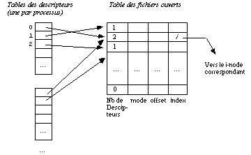

[Index Home](/) |
--------------- |

# Base de la programmation Linux

* [Variables d'Environnement](Environnement)
* [Processus](GCC/lesProcessus/)
* [Famille d'exec pour le recoivrement](ExecFamily)
* [Signaux](Signals)
* [Threads](Threads)
* Communication entre processus
  * [Tube anonyme](TubeAnonyme)
  * [Tube nommé](TubeNomme)
  * [Mémoire partagée POSIX](MemoirePartagee)
  * [Socket](/Sockets)
  * [Messages et Mémorei partagé System V](MSGQ)
* Synchronisation entre processus et/ou thread
  * [Semaphore System V](/ProgAvancee/SemaphorePourProc)
  * [Semaphore POSIX](Threads/SemaphoreTh.md)

## Généralités descripteur de fichier

Un descripteur de fichier est une clé abstraite (au niveaux d'un preocessus) pour accéder à un fichier (c'est un entier).

Un descripteur de fichier est un index d'une entrée dans le noyau-système, une structure de données contenant les détails de tous les fichiers ouverts.

Dans Linux, on appelle cette structure de données une table de descripteurs de fichier. Et chaque processus a sa propre table de descripteurs de fichier. L'application utilisateur passe la clé abstraite au noyau par un appel système et le noyau accèdera au fichier grâce à cette clé. L'application ne peut pas lire ou écrire directement la table des descripteurs de fichier.

Les descripteurs de fichier peuvent désigner des fichiers, des répertoires, des devices bloc ou caractère (souvent appelés fichiers spéciaux), des pipes nommés ou des pipes anonymes, des sockets.

[Linux programmation système (Index)](http://lps.cofares.net/)
