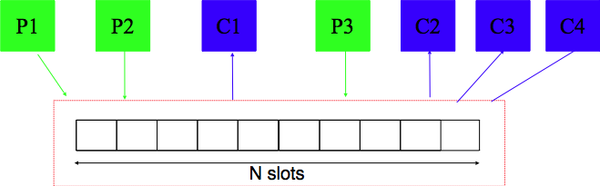

# Des problèmes résolues avec des sémaphores

## Exclusion mutuelle
Les sémaphores permettent de résoudre de nombreux problèmes classiques. Le premier est celui de l’exclusion mutuelle. Lorsqu’il est initialisé à 1, un sémaphore peut être utilisé de la même façon qu’un mutex. En utilisant des sémaphores, une exclusion mutuelle peut être protégée comme suit :

```C
#include <semaphore.h>

//...

sem_t semaphore;

sem_init(&semaphore, 0, 1);

sem_wait(&semaphore);
// section critique
sem_post(&semaphore);

sem_destroy(&semaphore);
```
Les sémaphores peuvent être utilisés pour d’autres types de synchronisation. Par exemple, considérons une application découpée en threads dans laquelle la fonction ensuite ne peut jamais être exécutée avant la fin de l’exécution de la fonction avant. Ce problème de coordination peut facilement être résolu en utilisant un sémaphore qui est initialisé à la valeur 0. La fonction ensuite doit démarrer par un appel à sem_wait sur ce sémaphore tandis que la fonction avant doit se terminer par un appel à la fonction sem_post sur ce sémaphore. De cette façon, si le thread qui exécute la fonction ensuite est trop rapide, il sera bloqué sur l’appel à sem_wait. S’il arrive à cette fonction après la fin de la fonction avant dans l’autre thread, il pourra passer sans être bloqué. Le programme ci-dessous illustre cette utilisation des sémaphores POSIX.

```C
#define NTHREADS 2
sem_t semaphore;

void *avant(void * param) {
  // do something
  for(int j=0;j<1000000;j++) {
  }
  sem_post(&semaphore);
  return(NULL);
}

void *ensuite(void * param) {
  sem_wait(&semaphore);
  // do something
  for(int j=0;j<1000000;j++) {
  }
  return(NULL);
}

int main (int argc, char *argv[])  {
  pthread_t thread[NTHREADS];
  void * (* func[])(void *)={avant, ensuite};
  int err;

  err=sem_init(&semaphore, 0,0);
  if(err!=0) {
      error(err,"sem_init");
  }
  for(int i=0;i<NTHREADS;i++) {
    err=pthread_create(&(thread[i]),NULL,func[i],NULL);
    if(err!=0) {
      error(err,"pthread_create");
    }
  }

  for(int i=0;i<NTHREADS;i++) {
    err=pthread_join(thread[i],NULL);
    if(err!=0) {
      error(err,"pthread_join");
    }
  }
  sem_destroy(&semaphore);
  if(err!=0) {
      error(err,"sem_destroy");
  }
  return(EXIT_SUCCESS);
}
```

Si conceptuellement un sémaphore initialisé à la valeur 1 est généralement utilisé comme un mutex, il y a une différence importante entre les implémentations des sémaphores et des mutex. Un sémaphore est conçu pour être manipulé par différents threads et il est fort possible qu’un thread exécute sem_wait et qu’un autre exécute sem_post. Pour les mutex, certaines implémentations supposent que le même thread exécute pthread_mutex_lock et pthread_mutex_unlock. Lorsque ces opérations doivent être effectuées dans des threads différents, il est préférable d’utiliser des sémaphores à la place de mutex.

## Rendez-vous
Le problème du rendez-vous (ou barrières) est un problème assez courant dans les applications multithreadées. Considérons une application découpée en N threads. Chacun de ces threads travaille en deux phases. Durant la première phase, tous les threads sont indépendants et peuvent s’exécuter simultanément. Cependant, un thread ne peut démarrer sa seconde phase que si tous les N threads ont terminé leur première phase. L’organisation de chaque thread est donc :

```C
premiere_phase();
// rendez-vous
seconde_phase();
 ```

Chaque thread doit pouvoir être bloqué à la fin de la première phase en attendant que tous les autres threads aient fini d’exécuter leur première phase. Cela peut s’implémenter en utilisant un mutex et un sémaphore.

```C
sem_t rendezvous;
pthread_mutex_t mutex;
int count=0;
sem_init(&rendezvous,0,0);
```

La variable count permet de compter le nombre de threads qui ont atteint le point de rendez-vous. Le mutex protège les accès à la variable count qui est partagée entre les différents threads. Le sémaphore rendezvous est initialisé à la valeur 0. Le rendez-vous se fera en bloquant les threads sur le sémaphore rendezvous tant que les N threads ne sont pas arrivés à cet endroit.

```C
premiere_phase();

// section critique
pthread_mutex_lock(&mutex);
count++;
if(count==N) 
{
    // tous les threads sont arrivés
    sem_post(&rendezvous);
}
pthread_mutex_unlock(&mutex);
// attente à la barrière
sem_wait(&rendezvous);
// libération d'un autre thread en attente
sem_post(&rendezvous);
seconde_phase();
```
Le pseudo-code ci-dessus présente une solution permettant de résoudre ce problème du rendez-vous. Le sémaphore étant initialisé à 0, le premier thread qui aura terminé la première phase sera bloqué sur sem_wait(&rendezvous);. Les N-1 premiers threads qui auront terminé leur première phase seront tous bloqués à cet endroit. Lorsque le dernier thread finira sa première phase, il incrémentera count puis exécutera sem_post(&rendezvous); ce qui libèrera un premier thread. Le dernier thread sera ensuite bloqué sur sem_wait(&rendezvous); mais il ne restera pas bloqué longtemps car chaque fois qu’un thread parvient à passer sem_wait(&rendezvous);, il exécute immédiatement sem_post(&rendezvous); ce qui permet de libérer un autre thread en cascade.

Cette solution permet de résoudre le problème du rendez-vous avec un nombre fixe de threads. Certaines implémentations de la librairie des threads POSIX comprennent une barrière qui peut s’utiliser de la même façon que la solution ci-dessus. Une barrière est une structure de données de type pthread_barrier_t. Elle s’initialise en utilisant la fonction pthread_barrier_init qui prend trois arguments : un pointeur vers une barrière, des attributs optionnels et le nombre de threads qui doivent avoir atteint la barrière pour que celle-ci s’ouvre. La fonction pthread_barrier_destroy permet de détruire une barrière. Enfin, la fonction pthread_barrier_wait qui prend comme argument un pointeur vers une barrière bloque le thread correspondant à celle-ci tant que le nombre de threads requis pour passer la barrière n’a pas été atteint.

## Producteurs consommateurs 

Le problème des producteurs-consommateurs est un problème extrêmement fréquent et important dans les applications découpées en plusieurs threads. Il est courant de structurer une telle application, notamment si elle réalise de longs calculs, en deux types de threads :

les producteurs : Ce sont des threads qui produisent des données et placent le résultat de leurs calculs dans une zone mémoire accessible aux consommateurs.
les consommateurs : Ce sont des threads qui utilisent les valeurs calculées par les producteurs.
Ces deux types de threads communiquent en utilisant un buffer qui a une capacité limitée à N slots comme illustré dans la figure ci-dessous.


Problème des producteurs-consommateurs

La difficulté du problème est de trouver une solution qui permet aux producteurs et aux consommateurs d’avancer à leur rythme sans que les producteurs ne bloquent inutilement les consommateurs et inversement. Le nombre de producteurs et de consommateurs ne doit pas nécessairement être connu à l’avance et ne doit pas être fixe. Un producteur peut arrêter de produire à n’importe quel moment.

Le buffer étant partagé entre les producteurs et les consommateurs, il doit nécessairement être protégé par un mutex. Les producteurs doivent pouvoir ajouter de l’information dans le buffer partagé tant qu’il y a au moins un slot de libre dans le buffer. Un producteur ne doit être bloqué que si tout le buffer est rempli. Inversement, les consommateurs doivent être bloqués uniquement si le buffer est entièrement vide. Dès qu’une donnée est ajoutée dans le buffer, un consommateur doit être réveillé pour traiter cette donnée.

Ce problème peut être résolu en utilisant deux sémaphores et un mutex. L’accès au buffer, que ce soit par les consommateurs ou les producteurs est une section critique. Cet accès doit donc être protégé par l’utilisation d’un mutex. Quant aux sémaphores, le premier, baptisé vide dans l’exemple ci-dessous, sert à compter le nombre de slots qui sont vides dans le buffer partagé. Ce sémaphore doit être initialisé à la taille du buffer puisqu’initialement celui-ci est vide. Le second sémaphore est baptisé plein dans le pseudo-code ci-dessous. Sa valeur représente le nombre de slots du buffer qui sont occupés. Il doit être initialisé à la valeur 0.

```C
// Initialisation
#define N 10 // slots du buffer
pthread_mutex_t mutex;
sem_t vide;
sem_t plein;

pthread_mutex_init(&mutex, NULL);
sem_init(&vide, 0 , N);  // buffer vide
sem_init(&plein, 0 , 0);   // buffer vide
```

Le fonctionnement général d’un producteur est le suivant. Tout d’abord, le producteur est mis en attente sur le sémaphore vide. Il ne pourra passer que si il y a au moins un slot du buffer qui est vide. Lorsque la ligne sem_wait(&vide); réussit, le producteur s’approprie le mutex et modifie le buffer de façon à insérer l’élément produit (dans ce cas un entier). Il libère ensuite le mutex pour sortir de sa section critique.

```C
// Producteur
void producteur(void) {
  int élément;
  while(true) {
    élément=produire(élément);
    sem_wait(&vide); // attente d'un slot libre
    pthread_mutex_lock(&mutex);
     // section critique
     inserereElement();
    pthread_mutex_unlock(&mutex);
    sem_post(&plein); // il y a un slot rempli en plus
  }
}
```
Le consommateur quant à lui essaie d’abord de prendre le sémaphore plein. Si celui-ci est positif, cela indique la présence d’au moins un élément dans le buffer partagé. Ensuite, il entre dans la section critique protégée par le mutex et récupère la donnée se trouvant dans le buffer. Puis, il incrémente la valeur du sémaphore vide de façon à indiquer à un producteur qu’un nouveau slot est disponible dans le buffer.

```C
// Consommateur
void consommateur(void) {
 int élément;
 while(true) {
   sem_wait(&plein); // attente d'un slot rempli
   pthread_mutex_lock(&mutex);
    // section critique
    élément=suprimerElement(élément);
   pthread_mutex_unlock(&mutex);
   sem_post(&vide); // il y a un slot libre en plus
 }
}
```
De nombreux programmes découpés en threads fonctionnent avec un ensemble de producteurs et un ensemble de consommateurs.
## Lecteurs rédacteurs

Le problème des lecteurs-rédacteurs est un peu différent du précédent. Il permet de modéliser un problème qui survient lorsque des threads doivent accéder à une base de données [Courtois+1971]. Les threads sont généralement de deux types.

les lecteurs (lecteurs) sont des threads qui lisent une structure de données (ou une base de données) mais ne la modifient pas. Comme ces threads se contentent de lire de l’information en mémoire, rien ne s’oppose à ce que plusieurs lecteurs s’exécutent simultanément.
les écrivains (rédacteurs). Ce sont des threads qui modifient une structure de données (ou une base de données). Pendant qu’un rédacteur manipule la structure de données, il ne peut y avoir aucun autre rédacteur ni de lecteur qui accède à cette structure de données. Sinon, la concurrence des opérations de lecture et d’écriture donnerait un résultat incorrect.
Une première solution à ce problème est d’utiliser un mutex et un sémaphore.

```C
pthread_mutex_t mutex;
sem_t db;  // accès à la db
int nbLecteurs=0; // nombre de lecteurs

sem_init(&db, NULL, 1).
```
La solution utilise une variable partagée : nbLecteurs. L’accès à cette variable est protégé par mutex. Le sémaphore db sert à réguler l’accès des rédacteurs à la base de données. Le mutex est initialisé comme d’habitude par la fonction pthread_mutex_init. Le sémaphore db est initialisé à la valeur 1. Le rédacteur est assez simple :
```C
void rédacteur(void) {
 while(true) {
   prepare_data();
   sem_wait(&db);
     // section critique, un seul rédacteur à la fois
     write_database();
   sem_post(&db);
   }
 }
}
```
Le sémaphore db sert à assurer l’exclusion mutuelle entre les rédacteurs pour l’accès à la base de données. Le fonctionnement des lecteurs est plus intéressant. Pour éviter un conflit entre les rédacteurs et les lecteurs, il est nécessaire d’empêcher aux lecteurs d’accéder à la base de données pendant qu’un rédacteur la modifie. Cela peut se faire en utilisant l’entier nbLecteurs qui permet de compter le nombre de lecteurs qui manipulent la base de données. Cette variable est testée et modifiée par tous les lecteurs, elle doit donc être protégée par un mutex. Intuitivement, lorsque le premier lecteur veut accéder à la base de données (nbLecteurs==0), il essaye de décrémenter le sémaphore db. Si ce sémaphore est libre, le lecteur accède à la base de données. Sinon, il bloque sur sem_wait(&db); et comme il possède mutex, tous les autres lecteurs sont bloqués sur pthread_mutex_lock(&mutex);. Dès que le premier lecteur est débloqué, il autorise en cascade l’accès à tous les autres lecteurs qui sont en attente en libérant pthread_mutex_unlock(&mutex);. Lorsqu’un lecteur arrête d’utiliser la base de données, il vérifie s’il était le dernier reader. Si c’est le cas, il libère le sémaphore db de façon à permettre à un rédacteur d’y accéder. Sinon, il décrémente simplement la variable nbLecteurs pour tenir à jour le nombre de lecteurs qui sont actuellement en train d’accéder à la base de données.

```C
void lecteur(void) {
 while(true) {
   pthread_mutex_lock(&mutex);
     // section critique
     nbLecteurs++;
     if (nbLecteurs==1) { // arrivée du premier reader
       sem_wait(&db);
     }
   pthread_mutex_unlock(&mutex);
   lireBD();
   pthread_mutex_lock(&mutex);
     // section critique
     nbLecteurs--;
     if(nbLecteurs==0) { 
         // départ du dernier reader
         sem_post(&db);
     }
   pthread_mutex_unlock(&mutex);
   process_data();
 }
}
Cette solution fonctionne et garantit qu’il n’y aura jamais qu’un seul rédacteur qui accède à la base de données. Malheureusement, elle souffre d’un inconvénient majeur lorsqu’il y a de nombreux lecteurs. Dans ce cas, il est tout à fait possible qu’il y ait en permanence des lecteurs qui accèdent à la base de données et que les rédacteurs soient toujours empêchés d’y accéder (famine ou coalition). En effet, dès que le premier lecteur a effectué sem_wait(&db);, aucun autre lecteur ne devra exécuter cette opération tant qu’il restera au moins un lecteur accédant à la base de données. Les rédacteurs par contre resteront bloqués sur l’exécution de sem_wait(&db);.

En utilisant des sémaphores à la place des mutex, il est possible de contourner ce problème. Cependant, cela nécessite d’utiliser plusieurs sémaphores. Intuitivement, l’idée de la solution est de donner priorité aux rédacteurs par rapport aux lecteurs. Dès qu’un rédacteur est prêt à accéder à la base de données, il faut empêcher de nouveaux lecteurs d’y accéder tout en permettant aux lecteurs présents de terminer leur lecture.

Cette solution utilise trois mutex, deux sémaphores et deux variables partagées : nbLecteurs et nbRedacteurs. Ces deux variables servent respectivement à compter le nombre de lecteurs qui accèdent à la base de données et le nombre de rédacteurs qui veulent y accéder. Le sémaphore wsem est utilisé pour bloquer les rédacteurs tandis que le sémaphore rsem sert à bloquer les lecteurs. Le mutex z a un rôle particulier qui sera plus clair lorsque le code des lecteurs aura été présenté. Les deux sémaphores sont initialisés à la valeur 1.

```C
/* Initialisation */
pthread_mutex_t mutex_nbLecteurs; // protège nbLecteurs
pthread_mutex_t mutex_nbRedacteurs; // protège nbRedacteurs
pthread_mutex_t z; // un seul lecteur en attente
sem_t wsem;       // accès exclusif à la db
sem_t rsem;       // pour bloquer des lecteurs
int nbLecteurs=0;
int nbRedacteurs=0;

sem_init(&wsem, 0, 1);
sem_init(&rsem, 0, 1);
``` 

Un rédacteur utilise la variable nbRedacteurs pour compter le nombre de rédacteurs qui veulent accéder à la base de données. Cette variable est protégée par mutex_nbRedacteurs. Le sémaphore wsem est utilisé pour garantir qu’il n’y a qu’un seul rédacteur qui peut accéder à un moment donné à la base de données. Cette utilisation est similaire à celle du sémaphore db dans la solution précédente.

```C
/* rédacteur */
while(true) {
  inventerDonees();

  pthread_mutex_lock(&mutex_nbRedacteurs);
    // section critique - nbRedacteurs
    nbRedacteurs=nbRedacteurs+1;
    if(nbRedacteurs==1) {
      // premier rédacteur arrive
      sem_wait(&rsem);
    }
  pthread_mutex_unlock(&mutex_nbRedacteurs);

  sem_wait(&wsem);
    // section critique, un seul rédacteur à la fois
    write_database();
  sem_post(&wsem);

  pthread_mutex_lock(&mutex_nbRedacteurs);
     // section critique - nbRedacteurs
     nbRedacteurs=nbRedacteurs-1;
     if(nbRedacteurs==0) {
       // départ du dernier rédacteur
       sem_post(&rsem);
     }
  pthread_mutex_unlock(&mutex_nbRedacteurs);
 }
```
Pour comprendre le reste du fonctionnement des rédacteurs, il faut analyser en parallèle le fonctionnement des lecteurs car les deux types de threads interagissent de façon importante. Un lecteur utilise la variable nbLecteurs protégée par le mutex_nbLecteurs pour compter le nombre de lecteurs en attente. Un lecteur utilise deux sémaphores. Le premier est wsem qui joue un rôle similaire au sémaphore db de la solution précédente. Le premier lecteur qui veut accéder à la base de données (nbLecteurs==1) effectue sem_wait(&wsem) pour garantir qu’il n’y aura pas de rédacteur qui accède à la base de données pendant qu’il s’y trouve. Lorsque le dernier lecteur n’a plus besoin d’accéder à la base de données (nbLecteurs==0), il libère les rédacteurs qui étaient potentiellement en attente en exécutant sem_post(&wsem).

Le sémaphore rsem répond à un autre besoin. Il permet de bloquer les lecteurs en attente lorsqu’un rédacteur veut accéder à la base de données. En effet, le premier rédacteur qui veut accéder à la base de données exécute sem_wait(&rsem). Cela a pour effet de bloquer les nouveaux lecteurs qui voudraient accéder à la base de données sur sem_wait(&rsem). Ils ne seront débloqués que lorsque le dernier rédacteur (nbRedacteurs==0) quittera la base de données et exécutera sem_post(&rsem). Lorsqu’aucun rédacteur n’accède à la base de données, les lecteurs peuvent facilement exécuter sem_wait(&rsem) qui sera rapidement suivi de sem_post(&rsem).

```C
/* lecteur */
while(true) {
  pthread_mutex_lock(&z);
    // exclusion mutuelle, un seul lecteur en attente sur rsem
    sem_wait(&rsem);

    pthread_mutex_lock(&mutex_nbLecteurs);
       // exclusion mutuelle, nbLecteurs
       nbLecteurs=nbLecteurs+1;
       if (nbLecteurs==1) {
          // arrivée du premier lecteur
          sem_wait(&wsem);
       }
  pthread_mutex_unlock(&mutex_nbLecteurs);
  sem_post(&rsem);  
  // libération du prochain lecteur
  pthread_mutex_unlock(&z);

  lireBD();

  pthread_mutex_lock(&mutex_nbLecteurs);
     // exclusion mutuelle, nbLecteurs
     nbLecteurs=nbLecteurs-1;
     if(nbLecteurs==0) {
          // départ du dernier lecteur
          sem_post(&wsem);
     }
  pthread_mutex_unlock(&mutex_nbLecteurs);
  utiliserLesDonneLus();
}
```

Pour comprendre l’utilité du mutex z, il faut imaginer une solution dans laquelle il n’est pas utilisé. Dans ce cas, imaginons que plusieurs lecteurs accèdent à la base de données et que deux lecteurs et deux rédacteurs veulent y accéder. Le premier lecteur exécute sem_wait(&rsem);. Le premier rédacteur va exécuter sem_wait(&rsem); et sera bloqué en attendant que le premier lecteur exécute sem_post(&rsem);. Le deuxième rédacteur sera bloqué sur pthread_mutex_lock(&mutex_nbRedacteurs);. Lorsque le premier lecteur exécute pthread_mutex_unlock(&mutex_nbLecteurs);, il permet au second lecteur de passer le mutex et d’exécuter sem_wait(&rsem);. Lorsque le premier lecteur exécute finalement sem_post(&rsem);, le système devra libérer un des threads en attente, c’est-à-dire le second lecteur ou le premier rédacteur. Cette solution ne donne pas complètement la priorité aux rédacteurs. Le mutex z permet d’éviter ce problème en n’ayant qu’un seul lecteur à la fois qui peut exécuter la séquence sem_wait(&rsem); ...  sem_post(&rsem);. Avec le mutex z, le second lecteur est nécessairement en attente sur le mutex z lorsque le premier lecteur exécute sem_post(&rsem);. Si un rédacteur est en attente à ce moment, il sera nécessairement débloqué.

Certaines implémentations de la librairie des threads POSIX contiennent des **_"Read-Write locks"_**. Ceux-ci constituent une API de plus haut niveau qui s’appuie sur des sémaphores pour résoudre le problème des lecteurs-rédacteurs. Les fonctions de création et de suppression de ces locks sont : `pthread_rwlock_init`, `pthread_rwlock_destroy`. Les fonctions `pthread_rwlock_rdlock` et `pthread_rwlock_unlock` sont réservées aux lecteurs tandis que les fonctions pthread_rwlock_wrlock et `pthread_rwlock_unlock` sont utilisables par les rédacteurs.