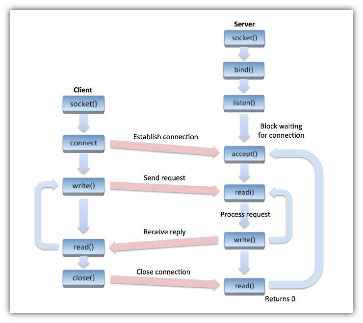
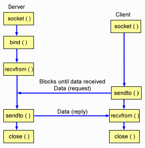

# Les étapes pour la comminication socket (Les protocoles TCP et UDP)

Vous trouverer le premier exemple simple en TCP [Exemple echo client server TCP](EchoTCP.md) et en UDP [Exemple echo client server UDP](EchoUDP.md)

## mode connecté TCP

### Le client

1. Création socket primitive [socket()](../API/#socket)
2. Connection au serveur
   1. Recupérer et initialiser l'adresse du serveur (gethostbyname ou getaddrinfo) J'utiliserais [getaddrinfo()](../GetAddr)
   2. connection primitive [connect()](../API/#connect)
3. (répétition) Envoi et reception de données (read et write) entre le client et le serveur (une socket est une file descriptor)
4. fermer la socket avec la primitive close 

### Le serveur

1. Création socket primitive [socket()](../API/#socket)
2. Créer la socket d'écoute
   1. initialiser une adresse ip:port (interface) dans la structure sockaddr_in pour la socket d'écoute en initialisant une structure adresse socket peut être fait directement ou en utilisant l'une des primitives (gethostbyname ou getaddrinfo) voir [Exemples](../Exemples)
   2. associer l'adresse a la socket avec la primitive [bind()](#bind)
3. Se mettre en attente des connections primitive [listen()](../API/#listen)
4. accepter la connection avec la primitive [accept()](../API/#accept)
5.  (répétition) Envoi et reception de données (read et write) entre le client et le serveur (une socket est une file descriptor)
6. fermer la socket avec la primitive close 

## Le mode non connecté UDP

### Le client

1. Création socket primitive [socket()](../API/#socket)
2. Recupérer et initialiser l'adresse du serveur (gethostbyname ou getaddrinfo) J'utiliserais [getaddrinfo()](../GetAddr)
3.  (répétition) Envoi et reception de données [sendto()](API/#sendto) et [recvfrom()](API/#recvfrom)
4. fermer la socket

### Le serveur

1. Création socket primitive [socket()](../API/#socket)
2. Créer l'interface (le service):  un ip port pour les clients
   1. initialiser une adresse ip:port (interface) dans la structure sockaddr_in pour la socket d'écoute en initialisant une structure adresse socket peut être fait directement ou en utilisant l'une des primitives (gethostbyname ou getaddrinfo) voir [Exemples](../Exemples)
   2. associer l'adresse a la socket avec la primitive [bind()](#bind)
3.  (répétition) Envoi et reception de données [sendto()](API/#sendto) et [recvfrom()](API/#recvfrom)
4. fermer la socket